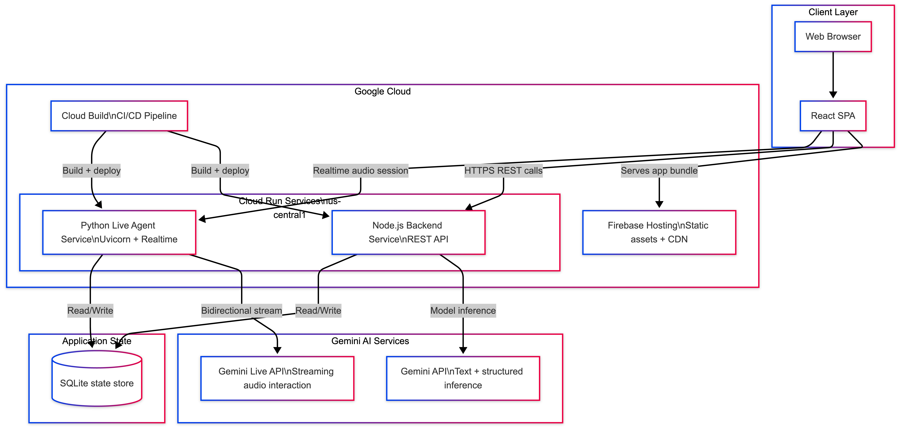

<div align="center">
  

  # Witness

  ### Every Room Tells a Story. Every Object Hides a Clue.

  Witness is a multimodal noir murder-mystery built for the Gemini Live Agent Challenge.
  Your real room becomes the crime scene, and an AI witness responds in text and live voice.
</div>

---

## Table of Contents
- Overview
- What Makes Witness Different
- Architecture
- Tech Stack
- Local Development
- Deploy to Google Cloud
- Project Structure
- Hackathon Alignment

---

## Overview
Witness turns physical space into interactive narrative gameplay:

- Scan a real room with your camera
- Generate room-aware evidence and witness persona
- Interrogate via text and live voice
- Detect contradictions during questioning
- Submit accusation and receive a generated case file

This project is designed to move beyond text-only chat by combining vision, realtime audio, and agentic orchestration.

## What Makes Witness Different
- Scene-grounded mystery generation: objects and atmosphere are derived from your actual room scan.
- Live witness interaction: voice interrogation is streamed through a dedicated realtime backend.
- Agentic control loop: contradiction detection, safety checks, and engagement nudges keep the narrative playable.
- End-to-end cloud deployment: frontends and backends run on Google Cloud services.

---

## Architecture
<div align="center">
  
</div>

Architecture source (editable Mermaid): [flowchart TB.mmd](flowchart%20TB.mmd)

### Service Roles
- Client: React single-page app in browser
- Hosting: Firebase Hosting serves static assets and SPA routes
- Backend 1: Node.js Cloud Run API for scene analysis, persona, interrogation, accusation flow
- Backend 2: Python Cloud Run live service for realtime voice sessions (FastAPI + ADK)
- AI: Gemini API for inference and Gemini Live API for streaming interactions
- Data: SQLite-backed runtime state
- Delivery: Cloud Build pipeline for automated image build + deploy

---

## Tech Stack
### Frontend
- React + TypeScript + Vite
- Tailwind CSS v4
- Motion animations

### Backend (Node)
- Express
- Google GenAI SDK

### Live Backend (Python)
- FastAPI + Uvicorn
- Google ADK (Agent Development Kit)
- WebSocket streaming

### Cloud
- Firebase Hosting
- Cloud Run
- Cloud Build

---

## Local Development
### Prerequisites
- Node.js 20+
- Python 3.11+
- Gemini API key

### 1) Install dependencies
```bash
npm install
```

### 2) Configure environment files
Create root .env:
```bash
GEMINI_API_KEY=your_key_here
```

Create root .env.local:
```bash
VITE_API_BASE_URL="http://localhost:8080"
VITE_LIVE_WS_URL="ws://localhost:8081"
```

Create live/.env from live/.env.example:
```bash
GOOGLE_GENAI_API_KEY=your_key_here
PORT=8081
```

### 3) Run services
Terminal A (Node API):
```bash
npm run server
```

Terminal B (Live Python API):
```bash
cd live
python3 -m venv .venv
source .venv/bin/activate
pip install -r requirements.txt
python -m uvicorn app.main:app --host 0.0.0.0 --port 8081
```

Terminal C (Frontend):
```bash
npm run dev
```

Open:
- Frontend: http://localhost:3000
- Live test page: http://localhost:8081/test-live

---

## Deploy to Google Cloud
### Backend (Node Cloud Run)
```bash
gcloud builds submit --config=cloudbuild.yaml .
```
Set Cloud Run environment variable:
- GEMINI_API_KEY

### Live Backend (Python Cloud Run)
```bash
gcloud builds submit --config=cloudbuild-live.yaml .
```
Set Cloud Run environment variable:
- GOOGLE_GENAI_API_KEY

### Frontend (Firebase Hosting)
Build with deployed backend URLs:
```bash
VITE_API_BASE_URL="https://YOUR_NODE_SERVICE.run.app" \
VITE_LIVE_WS_URL="wss://YOUR_LIVE_SERVICE.run.app" \
npm run build
```

Deploy:
```bash
firebase deploy --only hosting --project witness-489710
```

### Current Deployment URLs
- Frontend: https://witness-489710.web.app
- Node backend: https://witness-backend-640883260430.us-central1.run.app
- Live backend: https://witness-live-640883260430.us-central1.run.app

### Automated Deploy On Push To Main

This repository now includes CI/CD automation that deploys backend, live backend, and frontend whenever code is pushed to `main`.

- Workflow: [.github/workflows/deploy-main.yml](.github/workflows/deploy-main.yml)
- Setup guide: [docs/auto-deploy-main.md](docs/auto-deploy-main.md)
- One-command GCP setup script: [scripts/setup_github_oidc_deploy.sh](scripts/setup_github_oidc_deploy.sh)

Bootstrap the Google side for GitHub OIDC:

```bash
PROJECT_ID=witness-489710 GITHUB_REPO=OWNER/REPO ./scripts/setup_github_oidc_deploy.sh
```

For Devpost bonus proof, link directly to:

- [.github/workflows/deploy-main.yml](.github/workflows/deploy-main.yml)

---

## Project Structure
- [src](src): React app UI, flow logic, hooks, and services
- [server](server): Express backend and Gemini integration
- [live](live): Python realtime backend and witness ADK agent
- [cloudbuild.yaml](cloudbuild.yaml): Cloud Build pipeline for Node backend
- [cloudbuild-live.yaml](cloudbuild-live.yaml): Cloud Build pipeline for live backend
- [firebase.json](firebase.json): Firebase Hosting configuration
- [ArchitectureWitness.png](ArchitectureWitness.png): Final architecture image for docs and Devpost
- [flowchart TB.mmd](flowchart%20TB.mmd): Editable Mermaid architecture source

---

## Hackathon Alignment
This project aligns with Gemini Live Agent Challenge requirements:

- Uses Gemini models for scene understanding, persona generation, and interrogation
- Uses ADK for realtime live agent behavior
- Runs backend services on Google Cloud Run
- Uses Firebase Hosting for frontend delivery
- Includes architecture diagram and reproducible deployment path

---

If you are a judge or reviewer, start here:
1. Open the deployed frontend URL.
2. Scan a room and generate a witness.
3. Run both text and live voice interrogation.
4. Submit an accusation and inspect the generated case file.
